# Kata Ohce

A coding kata used as an example for my [Functional Testing]() article.

## Description

ohce is a console application that echoes the reverse of what you input through the console.

It reads from the keyboard a number n, where (0 <= n <= 23) , a y > 0 and a character string of length y. Display the reversed string and the program's first execution message as follows:
At program execution time:
* If the entered number n is between 6 and 12, a message m1 (¡Buenas tardes) is displayed;
* If the entered number n is between 12 inclusive and 20, a message m2 (¡Buenos días) is displayed;
* If the entered number n is in the range 20 <= n and n<=23 or n>=0 and n <= 6, a message m3 (¡Buenas noches) is displayed;
* If y <= 0 then an invalidation message m4 is displayed;
During program execution:
* If the input string is |s1| > y or |s1| = 0 then we display an invalidation message m4;
* If the entered string has the number of characters less than and, then we display the reverse of the string;
* If the input string is a palindrome We display a message m5. (¡Bonita palabra!) If the character with index n is found in the string, it splits the word after that character, wraps the words, concatenates back, then displays. Example: n=2, s1=racecar, new string must equal "arcecra";
* If the input string is equal to z, then the program execution ends and the message m6 (Adios <name>) is displayed;

### Input Data
* A positive integer n, representing the number at the time of program execution;
* A positive integer y, representing the maximum number of characters of the string s1;
* A character string s1;
* The option to display or not the inverse of the entered string by entering another string s2;

### Input Domain
* n must have values between 0 and 23, so 3 equivalence classes are distinguished:
  * N1_1 = 0...23
  * N1_2 = {n | n < 0}
  * N1_3 = {n | n > 23}
* y must be a positive number and greater than 0, so 2 classes of equivalence are distinguished:
  * N2_1 = {y | y > 0}
  * N2_2 = {y | y <= 0}
* s1 must be between 1 and y characters long, so 3 equivalence classes are distinguished;
  * N3_1 = {s1 | 1<=|s1|<=y}
  * N3_2 = {s1 | |s1| = 0}
  * N3_3 = {s1 | |s1| >y}
* The option to return from the inverse of a string is conditioned by the equality of string a with string z, so 2 classes of equivalence are distinguished:
  * N4_1 = {a | a is equal to z}
  * N4_2 = {a | a is not equal to z}

### Output Data
* String s1 is reversed;
* The message according to the intervals in which the number n is located;

These outputs are used to divide the input domain into 3 classes: one for the case where n is between 6 and 12, one for the case where n is between 12 and 20, and one for the case where n is between 20 and 23 or the range 0 and 6:

- M_1 = {n | n >= 6 and n < 12}
- M_2 = {n | n >= 12 and n < 20}
- M_3 = {n | (n >= 20 and n <= 23) or (n >=0 and n < 6)}

* The message m5 showing that the string entered is a palindrome;

These outputs are used to split the input domain into 2 classes: one for the case where s1 is palindrome and one where s1 is not palindrome:
* S_1 = {s1 | s1 is palindrome}
* S_2 = {s1 | s1 is not a palindrome}

* Message m6 showing the end of program execution if s2 is equal to z. Do not indicate additional equivalence classes;
* Message m4 showing that string s1 is invalid. Do not indicate additional equivalence classes;
* The character substring s3, extracted from s1 after the character associated with the index with n;


These outputs are used to split the input range into 2 classes: one for the case where index n of string s1 is found and the new string is displayed starting at that index character, and the second case when no character is found in s1 with index n:

* C_1 = {(n, s1) | s1[n] is null}
* C_2 = {(n, s1) | s1[n] is not null}

## Equivalence classes

* C_1112111 = {(n, y, s1, s2, (n, s1)) | n \in N1_1, y \in N2_1,s1 \in N3_1 , s2 \in N4_2, n \in M_1, s1 \in S_1, (n, s1) \in C_1}
* C_1111111 = {(n, y, s1, s2, (n, s1)) | n \in N1_1, y \in N2_1, s1 \in N3_1, s2 \in N4_1, n \in M_1 , s1 \in S_1, (n, s1) \in C_1}
* C_1111112= {(n, y, s1, s2, (n, s1)) | n \in N1_1, y \in N2_1, s1 \in N3_1, s2 \in N4_1, n \in M_1 , s1 \in S_1, (n, s1) \in C_2}
* C_111112 = {(n, y, s1, s2, (n, s1)) | n \in N1_1, y \in N2_1, s1 \in N3_1, s2 \in N4_1, n \in M_1 , s1 \in S_1}
* C_1111211 = {(n, y, s1, s2, (n, s1)) | n \in N1_1, y \in N2_1, s1 \in N3_1, s2 \in N4_1, n \in M_2 , s1 \in S_1, (n, s1) \in C_1}
* C_1111212 = {(n, y, s1, s2, (n, s1)) | n \in N1_1, y \in N2_1, s1 \in N3_1, s2 \in N4_1, n \in M_2 , s1 \in S_1, (n, s1) \in C_2}
* C_111122 = {(n, y, s1, s2, (n, s1)) | n \in N1_1, y \in N2_1, s1 \in N3_1, s2 \in N4_1, n \in M_2 , s1 \in S_2}
* C_1111311 = {(n, y, s1, s2, (n, s1)) | n \in N1_1, y \in N2_1, s1 \in N3_1, s2 \in N4_1, n \in M_3 , s1 \in S_1, (n, s1) \in C_1}
* C_1111312 = {(n, y, s1, s2, (n, s1)) | n \in N1_1, y \in N2_1, s1 \in N3_1, s2 \in N4_1, n \in M_3 , s1 \in S_1, (n, s1) \in C_2}
* C_111132 = {(n, y, s1, s2, (n, s1)) | n \in N1_1, y \in N2_1, s1 \in N3_1, s2 \in N4_1, n \in M_3 , s1 \in S_2}
* C_112 = {(n, y, s1, s2, (n, s1)) | n \in N1_1, y \in N2_1, s1 \in N3_2}
* C_113 = {(n, y, s1, s2, (n, s1)) | n \in N1_1, y \in N2_1, s1 \in N3_3}
* C_12 = {(n, y, s1, s2, (n, s1)) | n \in N1_1, y \in N2_2}
* C_2 = {(n, y, s1, s2, (n, s1)) | n \in N1_2}
* C_3 = {(n, y, s1, s2, (n, s1)) | n \in N1_3}

### Test data

* C_1112111: (10,50,oto, a, (10, oto))
* C_1111111: (10, 50, oto, z, (10, oto))
* C_1111112: (10.50, Anita la gorda lagartona does not smoke Latin drugs, z, (10, Anita la gorda lagartona does not smoke Latin drugs))
* C_111112: (10.50, natural, z, _)
* C_1111211: (13, 50, oto, z, (13, oto))
* C_1111212: (13, 50, Anita la gorda lagartona does not smoke Latin drugs, z, (13, Anita la gorda lagartona does not smoke Latin drugs))
* C_111122: (13, 50, natural, z, _)
* C_1111311: (21, 50, oto, z, (21, oto))
* C_1111312: (21, 50, Anita la gorda lagartona does not smoke Latin drugs, z (21, Anita la gorda lagartona does not smoke Latin drugs))
* C_111132: (21, 50, natural, z,_)
* C_112: (10, 50, "", _,_)
* C_113: (10, 3, "natural", _,_)
* C_12: (10, -1,_,_,_)
* C_2: (-1, _,_,_,_)
* C_3: (25,_,_,_,_)

## Boundary Value Analysis

* N1_1 = 0..23
  * 0, 23 (border values) and an interior value;
* N1_2 = {n | n < 0}
  * a -1 (boundary value) and an interior value;
* N1_3 = {n | n > 23}
  * a 24 (border value) and an interior value;
* M_1 = {n | n >= 6 and n < 12}
  * 6, 11 (border values) and one inside value;
* M_2 = {n | n >= 12 and n < 20}
  * 12.19 (border values) and an interior value;
* M_3 = {n | (n >= 20 and n <= 23) or (n >=0 and n < 6)}
  * 20.23 and 0.5 (boundary values) and an interior value;
* A_1 = {s1 | 1 <= |s1| <= y }
  * Minimum 1 , maximum length y and an interior value;
* C_1 = {(n, s1) | s1[n] is null}
  * There are no clear borders, so no additional values appear;
* C_2 = {(n, s1) | s1[n] is not null}
  * on first position in s1, on last position in s1, inside s1;

## Cause-effect Graph

1. Causes:
   * C1: The entered number n is between 6 inclusive and 12;
   * C2: The entered number n is between 12 and 20 inclusive
   * C3: The entered number n is greater than or equal to 20 and less than or equal to 23 or n is greater than or equal to 0 and less than 6;
   * C4: The entered number n is less than 0 or greater than 23;
   * C5: The length of the string s1 is between 1 and y;
   * C6: The length of the string s1 is not between 1 and y;
   * C7: The character with index n is in the string;
   * C8: The character with index n is not in the string;
   * C9: String s1 is palindrome;
   * C10: The string s1 is not a palindrome;
   * C11: The string s1 is equal to z;
   * C12: The string is not equal to z;
   * C13: y is less than or equal to 0;
   
2. Causes:
   * Ef1: Display string s1 inverted;
   * Ef2: Display the new string (s2) from s1;
   * Ef3: Display start message (message can be m1, m2, or m3)
   * Ef4: Display message m4 (problem requirements not met);
   * Ef5: Display message m5 (the message indicating whether the string s1 is a palindrome);
   * Ef6: Display message m6 (the program execution closing message);
   
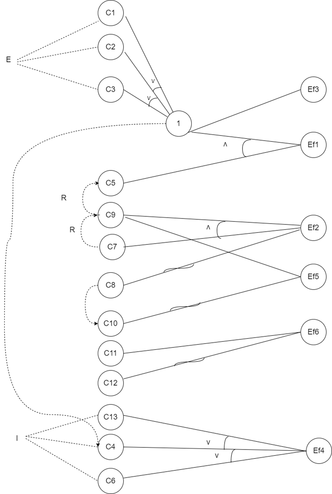

## Decision Table

Input: A cause-effect graph having causes C1, .... Cp and effects Ef1,....Efp, where p=13 and q=6
Output: A decision table having N=p+q rows and M columns

Procedure 1:
* No_columns = 0
* i=1 (where i = 1...q)
* e = Ef1

We look for the values of C1,C2, C3, C5 such that (C1 || C2 || C3) && C5 = 1, subject to the constraint that C4 be false.

| C1  | C2  | C3  | C5  | C4  |
|-----|-----|-----|-----|-----|
| 1   | 0   | 0   | 1   | 0   |
| 0   | 1   | 0   | 1   | 0   |
| 0   | 0   | 1   | 1   | 0   |

Add C6=0, C7=0, C9 =0, C8=0, C10=1, C11=1, C12=0, C13=0 and the problem values for Ef1, Ef2, Ef3, Ef4, Ef5, Ef6.

| C1  | C2  | C3  | C4  | C5  | C6  | C7  | C8  | C9  | C10 | C11 | C12 | C13 | Ef1 | Ef2 | Ef3 | Ef4 | Ef5 | Ef6 |
|-----|-----|-----|-----|-----|-----|-----|-----|-----|-----|-----|-----|-----|-----|-----|-----|-----|-----|-----|
| V1  | 1   | 0   | 0   | 1   | 0   | 0   | 0   | 0   | 1   | 1   | 0   | 0   | 1   | 0   | 1   | 0   | 1   | 1   |
| V2  | 0   | 0   | 0   | 1   | 0   | 0   | 0   | 0   | 1   | 0   | 0   | 0   | 1   | 0   | 1   | 0   | 1   | 1   |
| V3  | 0   | 1   | 0   | 1   | 0   | 0   | 0   | 0   | 1   | 0   | 0   | 0   | 1   | 0   | 1   | 0   | 1   | 1   |

The obtained matrix is transposed and added to the decision table starting from position nr_columns + 1= 1

|     | V1  | V2  | V3  |
|-----|-----|-----|-----|
| C1  | 1   | 0   | 0   |
| C2  | 0   | 1   | 0   |
| C3  | 0   | 0   | 1   |
| C4  | 0   | 0   | 0   |
| C5  | 1   | 1   | 1   |
| C6  | 0   | 0   | 0   |
| C7  | 0   | 0   | 0   |
| C8  | 0   | 0   | 0   |
| C9  | 0   | 0   | 0   |
| C10 | 1   | 1   | 1   |
| C11 | 1   | 1   | 1   |
| C12 | 0   | 0   | 0   |
| C13 | 0   | 0   | 0   |
| Ef1 | 1   | 1   | 1   |
| Ef2 | 0   | 0   | 0   |
| Ef3 | 1   | 1   | 1   |
| Ef4 | 0   | 0   | 0   |
| Ef5 | 1   | 1   | 1   |
| Ef6 | 1   | 1   | 1   |

No_columns = 0+3=3

Procedure 2:
* No_columns = 3
* i=1 (where i = 1...q)
* e = Ef2

We look for the values of C9 && C7 =1, taking into account the constraint that C9 requires C5 and C13 to be false.

| C5  | C7  | C9  | C13 |
|-----|-----|-----|-----|
| 1   | 1   | 1   | 0   |

Add C1=1, C2=0, C3=0, C4=0, C6=0, C8=0, C10=0, C11=1, C12=0 and the corresponding values for Ef1, Ef2, Ef3, Ef4, Ef5 , Eph6.

|     | C1 | C2  | C3  | C4  | C5  | C6  | C7  | C8  | C9  | C10 | C11 | C12 | C13 | Ef1 | Ef2 | Ef3 | Ef3 | Ef4 | Ef5 | Ef6 |
|-----|----|-----|-----|-----|-----|-----|-----|-----|-----|-----|-----|-----|-----|-----|-----|-----|-----|-----|-----|-----|
| V1  | 1  | 0   | 0   | 0   | 1   | 0   | 1   | 0   | 1   | 0   | 1   | 0   | 0   | 1   | 1   | 1   | 0   | 0   | 1   | 1   |

The obtained matrix is transposed and added to the decision table with position nr_columns + 1 = 1.

|     | V1  |
|-----|-----|
| C1  | 1   |
| C2  | 0   |
| C3  | 0   |
| C4  | 0   |
| C5  | 1   |
| C6  | 0   |
| C7  | 0   |
| C8  | 0   |
| C9  | 1   |
| C10 | 0   |
| C11 | 1   |
| C12 | 0   |
| C13 | 0   |
| Ef1 | 1   |
| Ef2 | 1   |
| Ef3 | 1   |
| Ef4 | 0   |
| Ef5 | 1   |
| Ef6 | 1   |


No_columns = 3+1=4

Procedure 3:

* No_columns = 4
* i=1 (where i = 1...q)
* e = Ef3

| C1 | C2  | C3  | C13 |
|----|-----|-----|-----|
| 1  | 0   | 0   | 0   |
| 0  | 1   | 0   | 0   |
| 0  | 0   | 1   | 0   |
| 0  | 0   | 0   | 0   |

Add C4=0,C5=1,C6=0, C7=0, C8=0, C9=0,C10=0,C11=1, C12=0 and the corresponding values for Ef1, Ef2, Ef3, Ef4, Ef5 , Ef6.

|     | C1 | C2  | C3  | C4  | C5  | C6  | C7 | C8  | C9  | C10 | C11 | C12 | C13 | Ef1 | Ef2 | Ef3 | Ef4 | Ef5 | Ef6 |
|-----|----|-----|-----|-----|-----|-----|----|-----|-----|-----|-----|-----|-----|-----|-----|-----|-----|-----|-----|
| V1  | 1  | 0   | 0   | 0   | 1   | 0   | 0  | 0   | 0   | 0   | 1   | 0   | 0   | 1   | 0   | 1   | 0   | 0   | 1   |
| V2  | 0  | 1   | 0   | 0   | 1   | 0   | 0  | 0   | 0   | 0   | 1   | 0   | 0   | 1   | 0   | 1   | 0   | 0   | 1   |
| V3  | 0  | 0   | 1   | 0   | 1   | 0   | 0  | 0   | 0   | 0   | 1   | 0   | 0   | 1   | 0   | 1   | 0   | 0   | 1   |
| V4  | 0  | 0   | 0   | 0   | 1   | 0   | 0  | 0   | 0   | 0   | 1   | 0   | 0   | 1   | 0   | 1   | 0   | 0   | 1   |


The obtained matrix is transposed and added to the decision table starting from position nr_columns + 1 = 1

|     | V1  | V2  | V3  | V4  |
|-----|-----|-----|-----|-----|
| C1  | 1   | 0   | 0   | 0   |
| C2  | 0   | 1   | 0   | 0   |
| C3  | 0   | 1   | 1   | 0   |
| C4  | 0   | 0   | 0   | 0   |
| C5  | 1   | 1   | 1   | 1   |
| C6  | 0   | 0   | 0   | 0   |
| C7  | 0   | 0   | 0   | 0   |
| C8  | 0   | 0   | 0   | 0   |
| C9  | 0   | 0   | 0   | 0   |
| C10 | 0   | 0   | 0   | 0   |
| C11 | 1   | 1   | 1   | 1   |
| C12 | 0   | 0   | 0   | 0   |
| C13 | 0   | 0   | 0   | 0   |
| Ef1 | 1   | 1   | 1   | 1   |
| Ef2 | 0   | 0   | 0   | 0   |
| Ef3 | 1   | 1   | 1   | 1   |
| Ef4 | 0   | 0   | 0   | 0   |
| Ef5 | 0   | 0   | 0   | 0   |
| Ef6 | 1   | 1   | 1   | 1   |


No_columns = 4+4=8

Procedure 4:
* No_columns = 8
* i=1 (where i = 1...q)
* e = Ef4

| C4  | C6  | C13 |
|-----|-----|-----|
| 1   | 0   | 0   |
| 0   | 1   | 0   |
| 0   | 0   | 1   |

Add C1=0 for variants V2 and C1=1 for variants V1 and V3, C2=,C3=,C5=1, C7=0, C8=0, C9=0,C10=0,C11=1, C12= 0 and the corresponding values for Ef1, Ef2, Ef3, Ef4, Ef5, Ef6.


|     | C1  | C2  | C3  | C4  | C5  | C6  | C7  | C8  | C9  | C10 | C11 | C12 | C13 | Ef1 | Ef2 | Ef3 | Ef4 | Ef5 | Ef6 |
|-----|-----|-----|-----|-----|-----|-----|-----|-----|-----|-----|-----|-----|-----|-----|-----|-----|-----|-----|-----|
| V1  | 0   | 0   | 0   | 1   | 0   | 0   | 0   | 0   | 0   | 0   | 0   | 0   | 0   | 0   | 0   | 0   | 1   | 0   | 0   |
| V2  | 1   | 0   | 0   | 0   | 0   | 1   | 0   | 0   | 0   | 0   | 0   | 0   | 0   | 0   | 0   | 0   | 1   | 0   | 0   |
| V3  | 1   | 0   | 0   | 0   | 0   | 0   | 0   | 0   | 0   | 0   | 0   | 0   | 1   | 0   | 0   | 0   | 1   | 0   | 0   |


The obtained matrix is transposed and added to the decision table with position nr_columns + 1 = 1


|     | V1  | V2  | V3  |
|-----|-----|-----|-----|
| C1  | 0   | 0   | 0   |
| C2  | 0   | 0   | 0   |
| C3  | 0   | 0   | 0   |
| C4  | 1   | 0   | 0   |
| C5  | 0   | 0   | 0   |
| C6  | 0   | 1   | 0   |
| C7  | 0   | 0   | 0   |
| C8  | 0   | 0   | 0   |
| C9  | 0   | 0   | 0   |
| C10 | 0   | 0   | 0   |
| C11 | 0   | 0   | 0   |
| C12 | 0   | 0   | 0   |
| C13 | 0   | 0   | 1   |
| Ef1 | 0   | 0   | 0   |
| Ef2 | 0   | 0   | 0   |
| Ef3 | 0   | 0   | 0   |
| Ef4 | 1   | 1   | 1   |
| Ef5 | 0   | 0   | 0   |
| Ef6 | 0   | 0   | 0   |


No_columns = 8+3=11

Procedure 5:
* No_columns = 11
* i=1 (where i = 1...q)
* e = Ef5

We look for value for C9 = 1, taking into account C9 requires C5.

| C5  | C9  |
|-----|-----|
| 1   | 0   |


Add C1=1, C2=0, C3= 0, C4= 0, C6=0, C7=0, C8=1, C10= 0, C11=1, C12=1, C13=0 and the corresponding values for Ef1 ,Ef2,Ef3,Ef4,Ef5,Ef6.

|     | C1  | C2  | C3  | C4  | C5  | C6  | C7  | C8  | C9  | C10 | C11 | C12 | 13  | E1  | Ef2 | Ef3 | Ef4 | Ef5 | Ef6 |
|-----|-----|-----|-----|-----|-----|-----|-----|-----|-----|-----|-----|-----|-----|-----|-----|-----|-----|-----|-----|
| V1  | 1   | 0   | 0   | 0   | 1   | 0   | 0   | 1   | 1   | 0   | 1   | 0   | 0   | 1   | 0   | 1   | 0   | 1   | 1   |

|     | V1  |
|-----|-----|
| C1  | 1   |
| C2  | 0   |
| C3  | 1   |
| C4  | 1   |
| C5  | 0   |
| C6  | 0   |
| C7  | 0   |
| C8  | 1   |
| C9  | 1   |
| C10 | 0   |
| C11 | 1   |
| C12 | 0   |
| C13 | 0   |
| Ef1 | 1   |
| Ef2 | 0   |
| Ef3 | 1   |
| Ef4 | 0   |
| Ef5 | 1   |
| Ef6 | 1   |

No_columns = 11+1=12

Procedure 6:
* No_columns = 12
* i=1 (where i = 1...q)
* e = Ef6

We have only one case, where C11=1.
The result is the decision table with Nr_columns = 12+1=13.

## Transforming the program into a directed graph
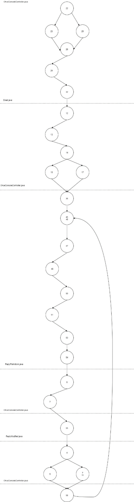

Conditions we cover:
C1: this.time >= 0
C2: this.time <= 23
C3: this.maxChatLength <= 0
C4: userInput.equals("Stop!")
C5: userInput.length() > this.maxChatLength
C6: "".equals(userInput)
C7: isPalindrome(input)
C8: index == 0
C9: index == (input.length() - 1)
C10: hours >= 6
C11: hours < 12
C12: hour >= 12
C13: hours < 20

* We build the test set table using MC/DC for C1 ˄ C2

| Test | C1  | C2  | C1∧C2 |
|------|-----|-----|-------|
| t1   | 1   | 1   | 1     |
| t2   | 1   | 0   | 0     |
| t3   | 0   | 1   | 0     |

t2 and t3 is testing C1
t1 and t2 is testing C2

* We construct the test set table using MC/DC for C3

| Test | C3  |
|------|-----|
| t1   | 1   |
| t2   | 0   |

t1 and t2 is testing C3

* We construct the test set table using MC/DC for C4

| Test | C4  |
|------|-----|
| t1   | 1   |
| t2   | 0   |

t1 and t2 is testing C4

* We build the test set table using MC/DC for C5 ˅ C6

| Test | C5  | C6  | C5˅C6 |
|------|-----|-----|-------|
| t1   | 1   | 0   | 1     |
| t2   | 0   | 1   | 1     |
| t3   | 0   | 0   | 0     |

t1 and t3 is testing C5
t1 and t2 is testing C6


| Test | C7  |
|------|-----|
| t1   | 1   |
| t2   | 0   |

t1 and t2 is testing C7

* We build the test set table using MC/DC for C8 ˅ C9

| Test | C8  | C9  | C8˅C9 |
|------|-----|-----|-------|
| t1   | 1   | 1   | 1     |
| t2   | 0   | 1   | 1     |
| t3   | 0   | 0   | 0     |
| t4   | 0   | 0   | 0     |

t1 and t4 is testing C8
t2 and t3 is testing C9

* We build the test set table using MC/DC for C10 ˄ C11

| Test | C10 | C11 | C10˄C11 |
|------|-----|-----|---------|
| t1   | 1   | 1   | 1       |
| t2   | 1   | 0   | 0       |
| t3   | 0   | 1   | 0       |

t2 and t3 is testing C10
t1 and t2 is testing C11

* We build the test set table using MC/DC for C12 ˄ C13

| Test | C12 | C13 | C12˄C13 |
|------|-----|-----|---------|
| t1   | 1   | 1   | 1       |
| t2   | 1   | 0   | 0       |
| t3   | 0   | 1   | 0       |

t2 and t3 is testing C12
t1 and t2 is testing C13

* We build the test set table using MC/DC for ¬(C10 ˄ C11) && ¬(C12 ˄ C13)

| Test | ¬(C10 ˄ C11) | ¬(C12 ˄ C13) | ¬(C10 ˄ C11) && ¬(C12 ˄ C13) |
|------|--------------|--------------|------------------------------|
| t1   | 1            | 1            | 1                            |
| t2   | 0            | 0            | 0                            |
| t3   | 1            | 0            | 0                            |
| t4   | 0            | 1            | 0                            |

## Mutation Testing

To carry out the tests with mutants we used the PITest utility. For each report we highlighted which mutants were generated and which further assays were implemented to kill those mutations.

Report 202103112049
1)
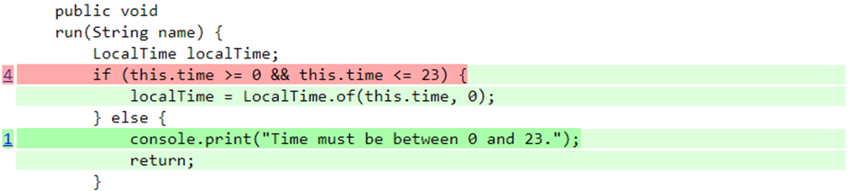

In this report, the non-equivalent mutant that survived was number 4. The change it made was changing the conditional boundaries: from this.time>=0 && this.time <= 23 changed to this.time > 0 && this.time < 23, thus negating the condition where time can be for example 0 or 23.

The solution was to check that when this.time is 0 or 23, it no longer displays console.print("Time must be between 0 and 23").

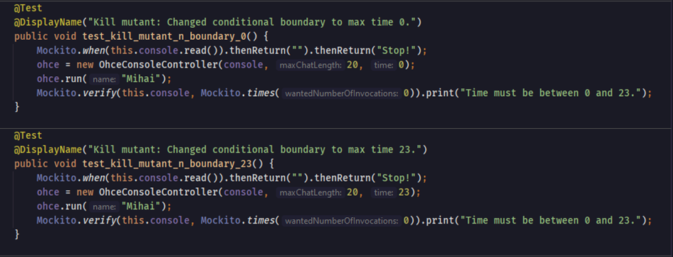
This is an example of using ohce during an evening:

Report 202103271140
2)
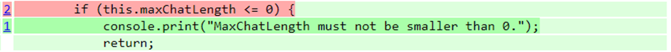

The next non-equivalent mutant left alive is changing this.maxChatLength <= 0 to this.maxChatLength < 0. The following test specifies for y = 0 to return the invalidation message.

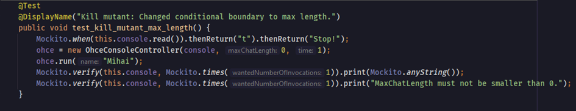

3)
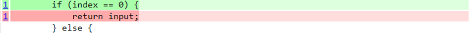

The following non-equivalent mutant changed the return for transforming the input if its index is word found.

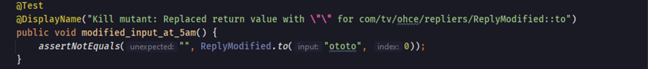

4)
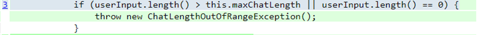

This mutant is interesting because in addition to negating the condition: userInput.length() > this.maxChatLength || userInput.length() == 0 in userInput.length() <= this.maxChatLength || userInput.lenght() == 0, caused the application to enter a repetitive loop where the program does not exit due to the exception and waits for new input from the user.
Killing this non-equivalent mutant required creating a test that directly specifies that when the length of the string is equal to y, I don't display the error message, and for the other condition it was killed by the tests created up to this point.

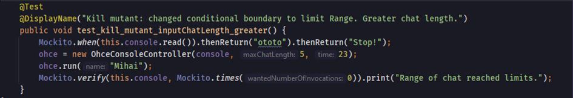

5)
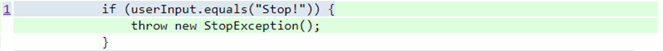

Mutant 5 did the same thing. He negated the condition that when he writes in the chat "Stop!" to check that it is not equal and the non-equal mutant breaks the program closure.

The solution was:
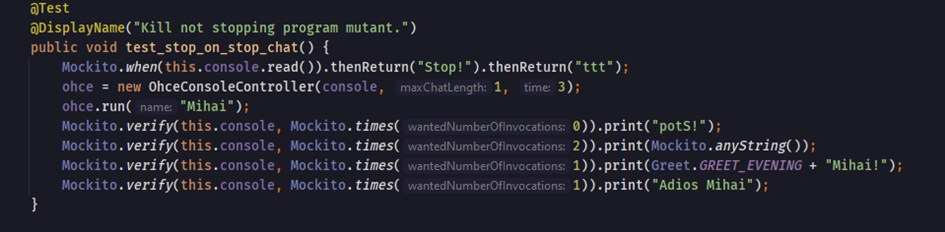

Report 202103271245 shows the results for all mutants killed by the tests created above. Mutation testing came out 100% for this project.

```text
¡Buenas noches Mihai!
hola
aloh
oto
oto
¡Bonita palabra!
stop
pots
Stop!
Adios Mihai
```

[Kata Ohce](https://kata-log.rocks/ohce-kata)
